# SPARTAMARKET

## Project Description
스파르타 마켓을 DRF로 구현

## App
### products
- 조회/등록/수정/삭제
    - 메인페이지에서 게시글 작성과 게시글의 상세페이지를 확인할 수 있고 상세페이지에서는 게시글의 수정과 삭제를 할 수 있습니다.
- 사진
    - 게시글을 작성할 때 사진을 첨부할 수 있습니다.
### accounts
- 회원가입
    - 회원가입을 회원의 정보를 db 저장
- 프로필 조회
    - 각 유저의 계정 상세페이지로 이동할 수 있습니다. 이곳에서 유저의 대부분의 정보를 확인할수있습니다
- 로그인
    - 로그인으로 permission과 token을 받아 더 많은 기능을 사용할수있습니다


## ERD/Framework
- 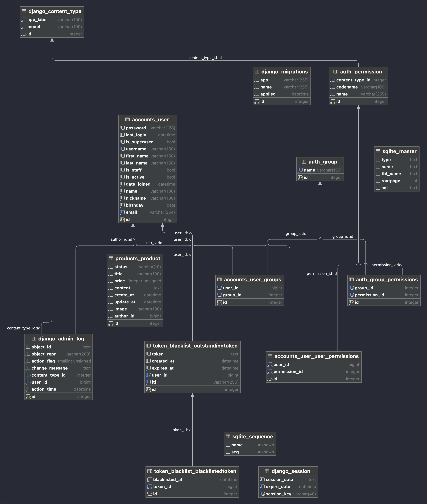
- 프로젝트 구조
```
📦
├─ .gitignore
├─ .idea
│  ├─ .gitignore
│  ├─ dataSources.xml
│  ├─ git_toolbox_blame.xml
│  ├─ inspectionProfiles
│  │  └─ profiles_settings.xml
│  ├─ misc.xml
│  ├─ modules.xml
│  ├─ spartamarket_DRF.iml
│  └─ vcs.xml
├─ README
├─ accounts
│  ├─ __init__.py
│  ├─ admin.py
│  ├─ apps.py
│  ├─ migrations
│  │  ├─ 0001_initial.py
│  │  └─ __init__.py
│  ├─ models.py
│  ├─ serializers.py
│  ├─ tests.py
│  ├─ urls.py
│  └─ views.py
├─ manage.py
├─ products
│  ├─ __init__.py
│  ├─ admin.py
│  ├─ apps.py
│  ├─ migrations
│  │  ├─ 0001_initial.py
│  │  └─ __init__.py
│  ├─ models.py
│  ├─ serializers.py
│  ├─ tests.py
│  ├─ urls.py
│  └─ views.py
├─ requirements.txt
└─ spartamarket_DRF
   ├─ __init__.py
   ├─ asgi.py
   ├─ settings.py
   ├─ urls.py
   └─ wsgi.py
```


## Troubling/Troubleshooting
- 본인의 게시글에만 수정 삭제 가능하도록 basepermission를 오버라이딩 하여 권한 부여하였지만
지속적으로 로그인된 사용자라면 수정 삭제 가능 확인
    -  문제는 상세페이지에서 get.object 로 404 오류메세지 발생하는 로직을 넣었는데 오버라이딩
과정에서 모두 모두 사용되다보니 basspermission 에서 오버라이딩 했던 로직이 실행되지 않고있었음
404 오류 로직은 삭제하고 RetrieveUpdateDestroyAPIView 기본내장 오류 메세지 사용
- readme 작성한게 파이참에서 열리지 않아 수정 및 확인이 어려운점 확인
    -  파일이 파이참에서 마크다운 형식으로 연결이 되지않아 설정에서 파일프로퍼티에서 직접 파일형식 연결로 해결


## 기능 점검
- 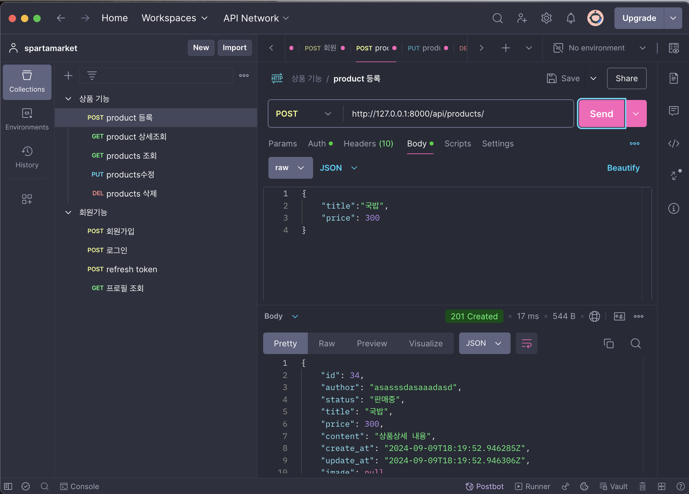
- 상품등록
- 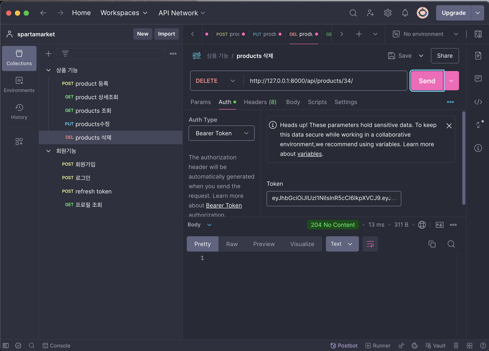
- 상품삭제
- - 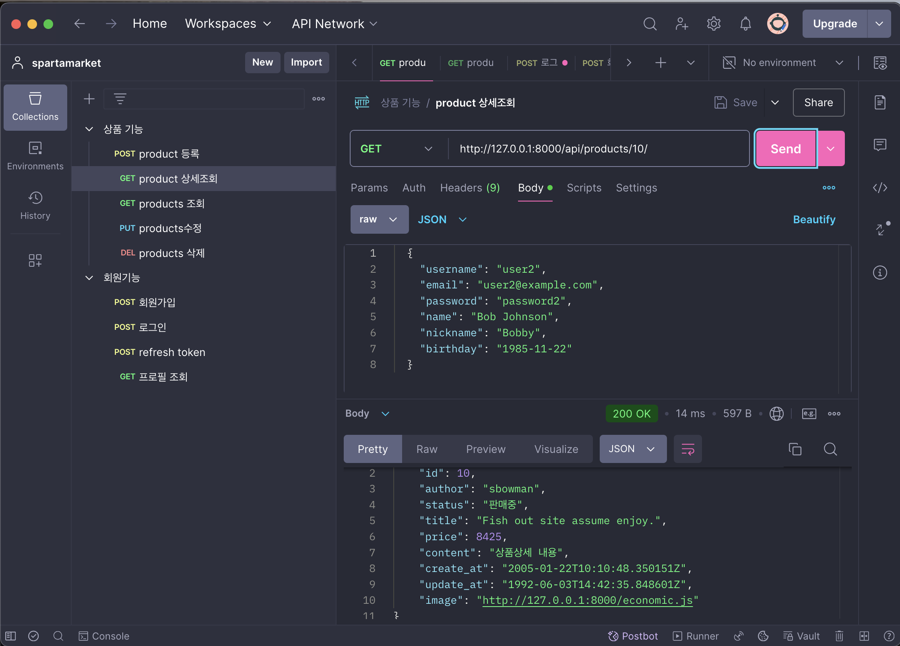
- 상품 상세조회
- - 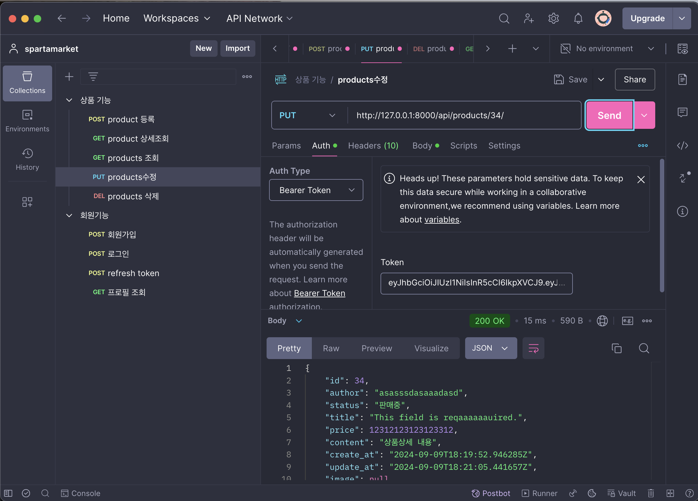
- 상품 수정
- 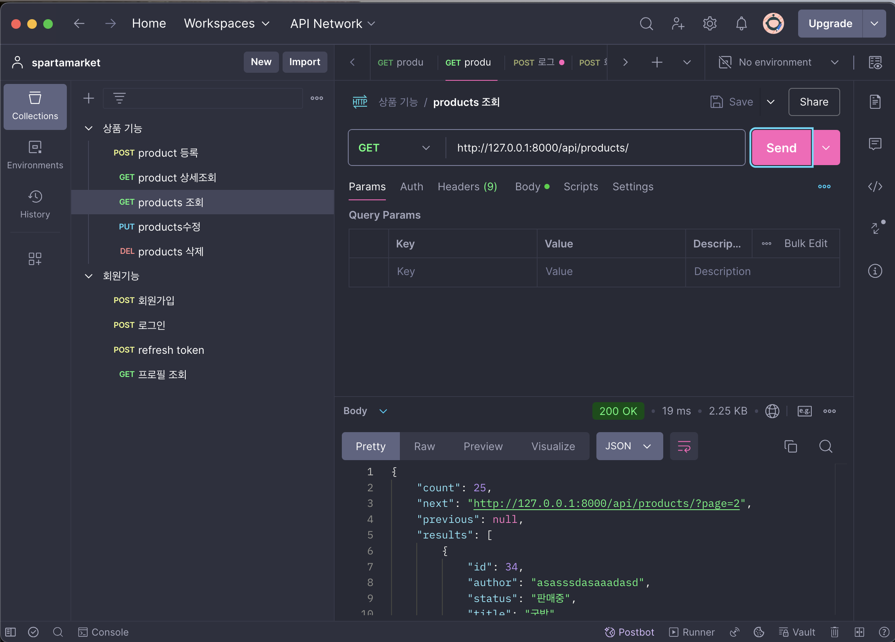
- 모든 상품조회
- - 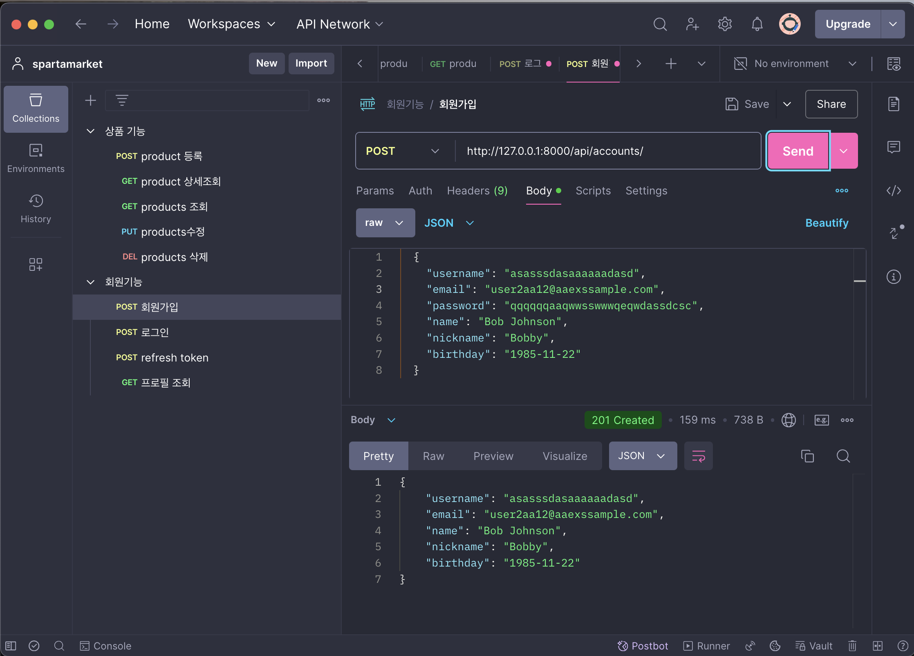
- 회원가입
- - 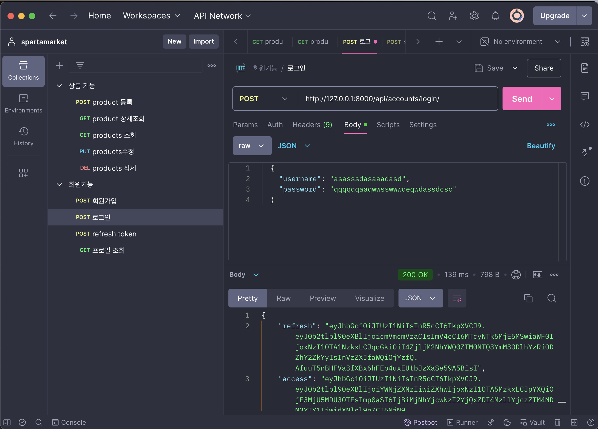
- 로그인
- - 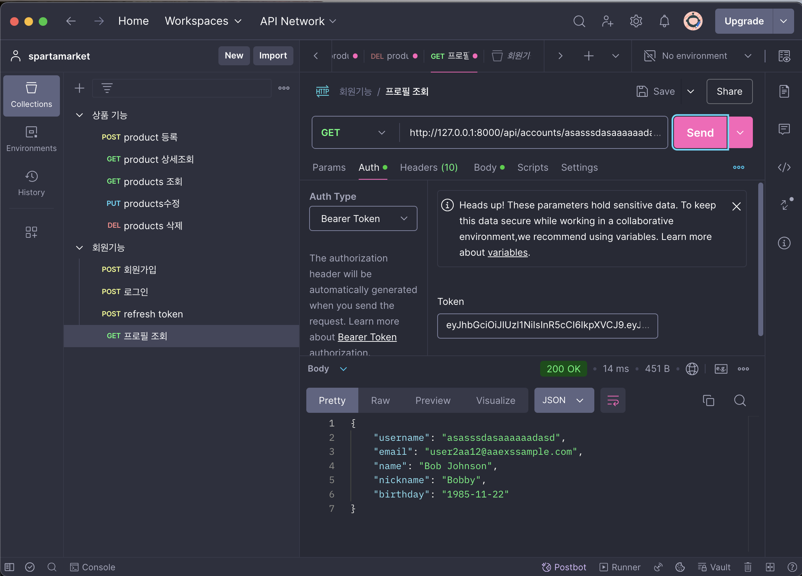
- 프로필
- - 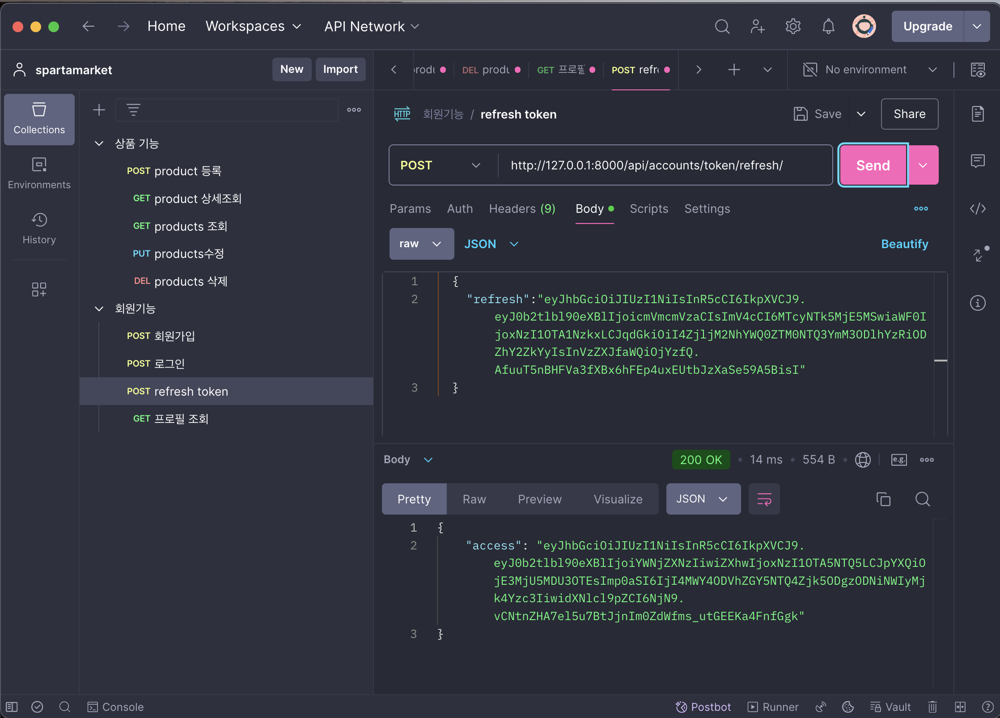
- 토큰 리프레쉬
- 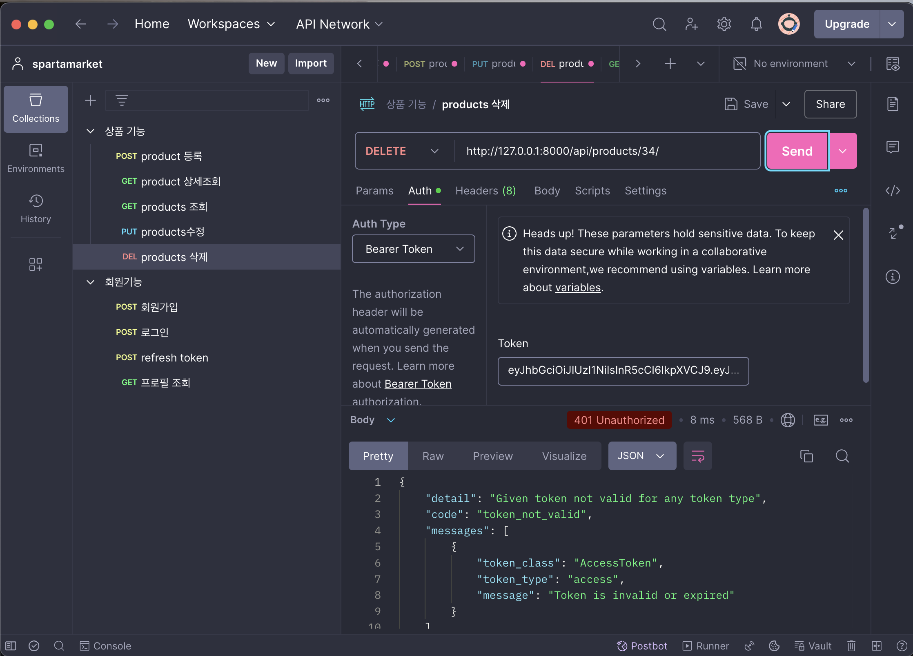
- 토큰 으로 보안 확인
- 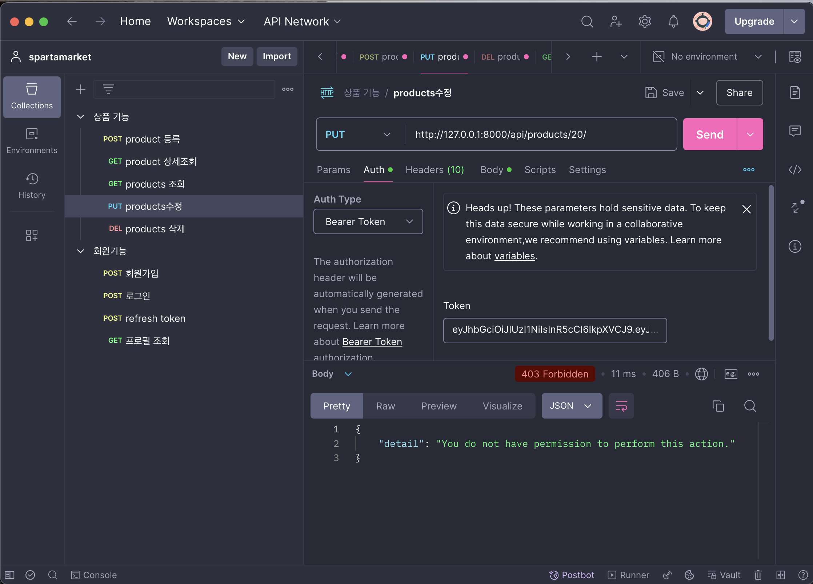
- 퍼미션으로 권한확인

## Version
asgiref==3.8.
black==24.8.0
click==8.1.7
Django==4.2
django-seed==0.3.1
djangorestframework==3.15.2
djangorestframework-simplejwt==5.3.1
Faker==28.4.1
listview==0.1.0
mypy-extensions==1.0.0
packaging==24.1
pathspec==0.12.1
pillow==10.4.0
platformdirs==4.2.2
psycopg2==2.9.9
PyJWT==2.9.0
python-dateutil==2.9.0.post0
six==1.16.0
sqlparse==0.5.1
tomli==2.0.1
toposort==1.10
typing_extensions==4.12.2
